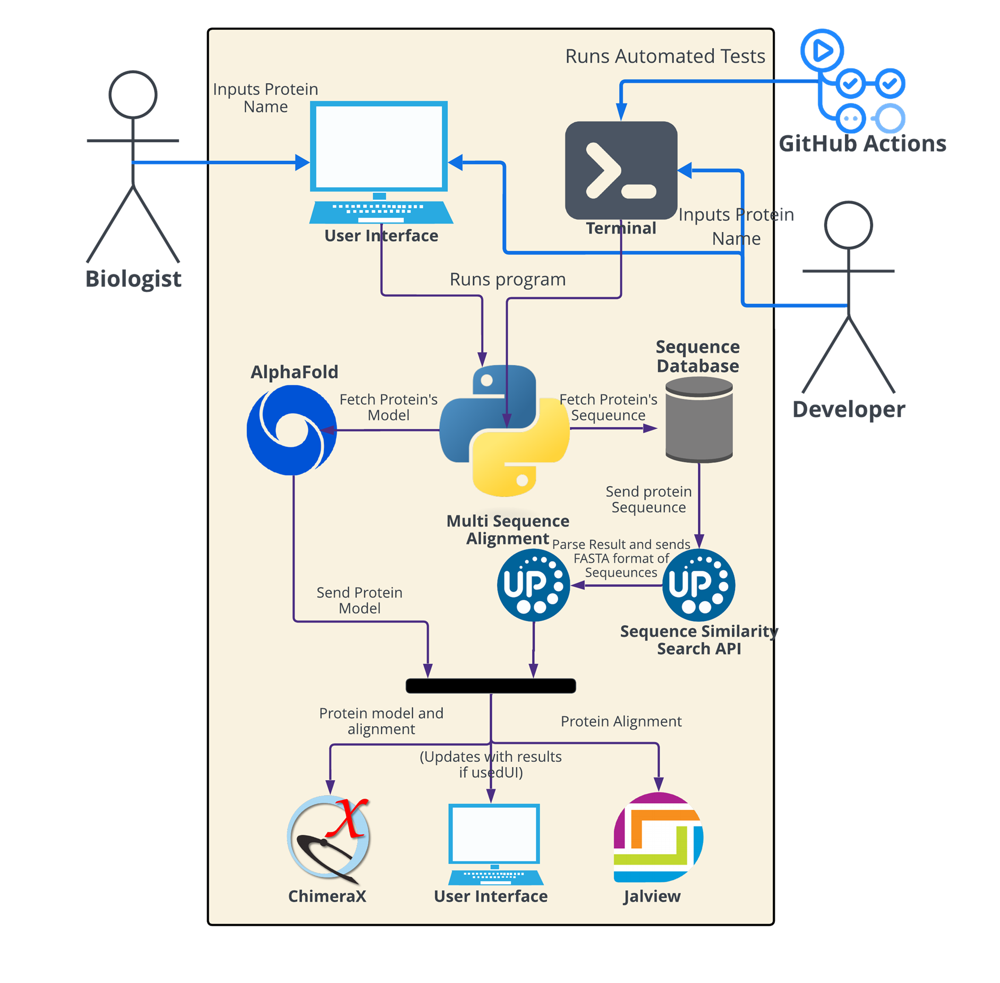
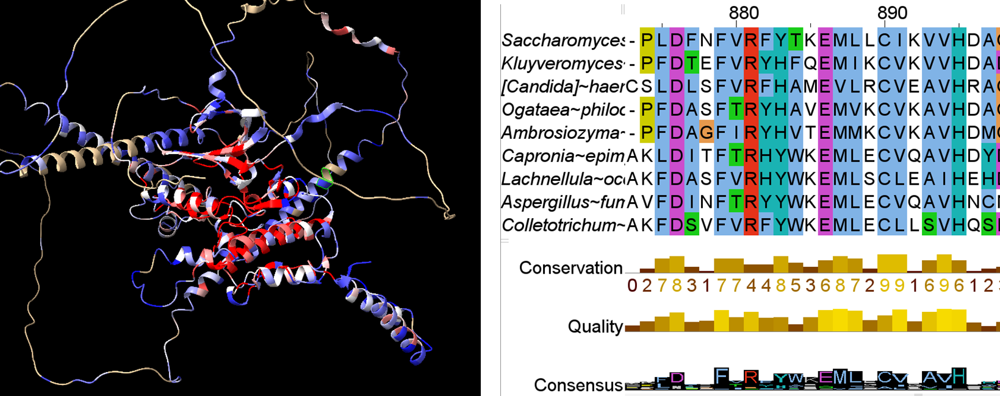

# BinghamCanyon

## Abstract:

Saccharomyces cerevisiae, commonly known as yeast, originated hundreds of millions of years ago, while humans emerged only hundreds of thousands of years ago. Despite this vast difference in evolutionary time, there are still proteins that we share. This project aims to automate the analysis of RNA protein sequences in yeast cells to identify conserved and divergent regions within the same protein across a wide range of species, including humans.

## Project Goals:

The biologists have 3 main methods they requested to be implemented. They provided clear, step-by-step instructions for implementing the three methods and the steps after

1. Method 1: Analyze a given yeast protein and identify similar proteins in any species based on their conservation score.
2. Method 2: Analyze a given yeast protein specifically across pre-defined fungal species.
3. Method 3: Analyze a given yeast protein across evolutionary timeframes (wide range of species including humans)
   Using the selected method, the project will automatically fetch the protein model, align the protein sequences, and launch Jalview and ChimeraX with the relevant data.

## Methodology & Design:

We utilized Python for its extensive library support and implemented dependency injection to enhance the system's flexibility. This design allows for easy swapping of API. Currently, the system uses with REST APIs from the European Bioinformatics Institute (EBI). However, in the future, we may download the database to perform our own queries, reducing reliance on third-party software. With this architecture, changing the API requires modifying only one line of code, a process made possible by Python’s Protocols, which effectively serve as an interface.

1. Collaborated closely with biologists via Zoom and email to identify functional requirements, getting feedback on the current status of the project, and gather necessary biology-related information.
2. Consulted with Professor Brent Lagesse to discuss the structure and design of the code.
3. Researched how to programmatically execute the instructions provided by the biologists and began coding the project, followed by refactoring the code when necessary
4. Repeat steps 1-3, continuing further development and refinement based on feedback received.

## Code Structure

- **chimerax_scripts/**: Python scripts that are passed into ChimeraX to execute and runs task automatically.
- **classes/**: Most of the Python files have an a `_Protocol_` class (Python version of interface) at the top, followed by the classes that implement them.
- **main.py**: The main executable
- **display.py**: Handles the GUI and subsequently runs `main.py`.
- **utils/**: Contains helper methods
- **config.json**: Stores configuration settings.
- **constants.py**: Defines constants used throughout the program to avoid hardcoding values.
- **output/**: Directory for saving generated output files.

## Design Choices

The code extensively uses [Dependency Injection](https://www.youtube.com/watch?v=J1f5b4vcxCQ), which ensures easier testing and future-proofing, especially if APIs become deprecated. For example, running a BLAST operation can take about 8 minutes, but with dependency injection, a test version can be injected that simulates the output without the long wait.

The UI and functionality are separate, which simplifies testing and development. Currently, the UI simply runs `main.py` with flags and returns the results.

For the UI, **Nice GUI** was chosen due to its minimal code requirements, aesthetic appeal, and open-source support. However, it introduces numerous dependency packages, complicating the creation of a standalone executable using tools like PyInstaller. Alternatives like Tkinter are lightweight but offer limited built-in components, so a future switch to another UI library might be considered despite the trade-offs.

## Current State

The code is designed to open ChimeraX and Jalview, as depicted in the images below.

Here is an overview of the code's high-level functionality:

What ChimeraX and Jalview should look like:

Due to time constraints, some features were not implemented cleanly. The flag system in `main.py` is primitive, and the configuration options are somewhat buggy and incomplete. The goal is to allow users to choose methods (1, 2, 3, etc.) and decide whether to use a local database or fetch data via a REST API, which is currently functioning. Please refer to the GitHub issues and the numerous `TODO:` comments for outstanding tasks. Method 1 is nearly complete, but there are still several features that need to be implemented.

## Additional Information

Refer to the email exchanges with the biologist for extensive knowledge and clarifications.

## Getting Started / How to Contribute

To get started, refer to `docs/installing_python_running_aln_tool.pdf` for installation instructions. Additionally, install Jalview and ChimeraX, as these applications will be launched automatically. Although the guide is slightly outdated and for Macs, it should mostly apply and demonstrate how to run the GUI and code. For instance, on Windows, you use `python` instead of `python3` in the terminal.

For understanding the workflow, explore the documentation folder and follow the complete steps for the method you're working on, most likely Method 1.

#### TLDR

- To run the GUI: `python3 display.py`
- To run the program in the terminal: `python3 main.py`

Also shoutout to Manaswee who gracefully help build the UI
